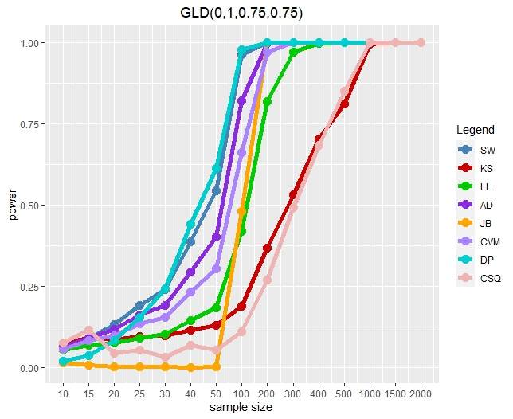

# Section 1: Introduction
  
Normal distributions are most common distributions used in statistical theory and applications. Performing statistical analysis using parametric methods, validation of the normality assumption must need to be checked. Graphical methods like histogram, Q-Q plot or box plot can be used to check that assumption. Due to subjective nature of these methods, they do not provide the formal conclusive evidence about normality assumption. Formal normality tests come to handy and can be reliable for validating normality assumption. There are a significant number of tests of normality available. But, they are created under certain conditions or assumptions.This paper did the comparison of 8 selected normality tests based on Type I error rate and power of these tests.

## Tests

1. **Shapiro-Wilk test (SW test)**

    $$SW = \frac{\left[\sum_{i=1}^n a_i Y_i\right]^2}{\sum_{i=1}^n (Y_i - \bar{Y})^2}$$
    
    Small values of $SW$ lead to the rejection of normality; a value of one indicates normality of the data.
    
2. **Kolmogorov-Smirnov test (KS test)**
    
    $$KS^{+} = \underset{x}{sup} [F^{*}(x) - F_n (x)] \quad \quad KS^{-} = \underset{x}{sup} [F_n(x)-F^{*}(x)]$$
    
    $$KS = max(KS^{+}, KS^{-})$$
    
    Large values of $KS$ indicate non-normality of the sample.
    
3. **Lilliefors test (LL test)**

    The LL test statistic is similar to the KS test statistic except $\mu$ and $\sigma$ are replaced by the sample mean and sample standard deviation.
    
    $$LL^{+} = \underset{x}{sup} [F^{*}(x) - F_n (x)] \quad \quad LL^{-} = \underset{x}{sup} [F_n(x)-F^{*}(x)]$$
    
    $$LL = max(LL^{+}, LL^{-})$$
    
4. **Cramer-Von mises test (CVM test)**

    The Cramer-von Mises test can be defined by $$nw^2 = n \int_{-\infty}^{\infty} [F(x)-F^{*}(x)]^2 dF(x)$$
    
    The CVM test can be written (assuming that $X_{(1)} \leq X_{(2)} \leq \ldots \leq X_{(n)}$ is an ordered sample of size $n$) as
    
    $$CVM=\frac{1}{12n} + \sum_{i=1}^n \left(Z_i - \frac{2i-1}{2n}\right)^2 $$
    
    where $Z_i = \Phi\left(\frac{X_{(i)}-\bar X}{S}\right)$, $\bar X = \frac{\sum_{i=1}^n X_i}{n}$, $S^2 = \frac{\sum_{i=1}^n (X_i - \bar X)^2}{n-1}$, and $\Phi(x)$ is the standard hypothesized normal distribution of the null hypothesis.
    
5. **Anderson-Darling test (AD test)**
    
    $$AD = n \int_{-\infty}^{\infty} [F(x)-F^{*}(x)]^2 \psi (F(x)) dF(x)$$
    
    Assuming that $X_{(1)} \leq X_{(2)} \leq \ldots \leq X_{(n)}$ is an ordered sample of size $n$, the statistic can be rewritten as
    
    $$AD = -\sum \left[\frac{(2i-1)(\log P_i + \log(1-P_{n+1-i}))}{n}\right] - n$$
    
    where $P_i$ is the CDF of the specified distribution and $\log$ is $\log_e$ . 
    
    To test normality, $P_i = \Phi(Y_{(i)})$ where $Y_{(i)} = \frac{X_{(i)}-\bar X}{S}$ and $\bar X$ and $S$ are the sample mean and sample standard deviation, respectively.
    
6. **Pearson's Chi-Squared test (CSQ test)** 
7. **Jarque-Bera test (JB test)**

    $$JB = n\left(\frac{(\sqrt{b_1})^2}{6} + \frac{(b_2 - 3)^2}{24} \right)$$
    
    where $\sqrt{b_1}$ is the skewness and $b_2$ is the kurtosis.
    
    Large valuse of the skewness and kurtosis that are far from 3 lead to the rejection of the null hypothesis of normality.
    
8. **D’Agostino–Pearson Omnibus test (DP test)**

    $$DP = Z^2 (\sqrt{b_1}) + Z^2 (b_2)$$
    
    where $Z(\sqrt{b_1})$, $Z(b_2)$ are the normal approximations to $\sqrt{b_1}$ and $b_2$.

Hypothesis testing for Normality assumption(whether the observed sample comes from a population with a normal distribution)

**H0**: Observed sample comes from a population with a normal distribution (OR Non-normal distribution comes from the normal distribution family) (OR Random sample of n independent observations come from a population with a normal $N(\mu,\sigma^2)$ ) )
**H1**: Observed sample does not come from a population with a normal distribution (or Non-normal distribution does not come from the normal distribution family.) (OR Random sample of n independent observations does not come from a population with a normal $N(\mu,\sigma^2)$ )) criteria to do comparison among the 8 normality tests:
1. They all should have the same probability of rejecting the Null Hypothesis when the distribution is truly normal(Same Type-I error rate(significance level: $\alpha$ ). $\alpha=0.05$ is considered for all simulation results.

## Random variates generated from Standard Normal Distributions
1. 50,000 simulated samples for particular sample size are generated using `rnorm` function with mean=0 and standard deviation=1; and then the Test Statistic values are obtained from them.
2. For a particular sample size, the 50,000 generated test statistics are sorted to generate an empirical distribution
3. quantile function is used to get the sample quantile from the generated empirical distribution for the mentioned probability. That value of sample quantile is used as the Critical value. 
4. Left-tailed test: **SW test** and Critical values are the $100(\alpha)$th percentile of the empirical distribution
5. For Right-tailed tests: **AD, LL, CVM, DP,JB and CSQ tests** : and  Two-tailed test: **KS test**: , Critical values are the $100(1-\alpha)$th percentiles of the empirical distribution
6. For **CSQ test**, we used different approach than paper to compute the number of bins. We used the R function `nclass.scott(x)` to compute it. 
7. For **DP Omnibus test**, we have done the modification in original source code, so it can consider the sample size less than 20 as well.

```{r}
# Edited from dagoTest(x) in fBasics library. 
omnibus.test <- function(x){
  # Internal Function for D'Agostino Normality Test:
  
  # FUNCTION:
  if (exists("complete.cases")) {
    test = complete.cases(x)
  } else {
    test = !is.na(x)
  }
  x = x[test]
  n = length(x)
  meanX = mean(x)
  s =  sqrt(mean((x-meanX)**2))
  a3 = mean((x-meanX)**3)/s**3
  a4 = mean((x-meanX)**4)/s**4
  SD3 = sqrt(6*(n-2)/((n+1)*(n+3)))
  SD4 = sqrt(24*(n-2)*(n-3)*n/((n+1)**2*(n+3)*(n+5)))
  U3 = a3/SD3
  U4 = (a4-3+6/(n+1))/SD4
  b  = (3*(n**2+27*n-70)*(n+1)*(n+3))/((n-2)*(n+5)*(n+7)*(n+9))
  W2 = sqrt(2*(b-1))-1
  delta = 1/sqrt(log(sqrt(W2)))
  a = sqrt(2/(W2-1))
  Z3 = delta*log((U3/a)+sqrt((U3/a)**2+1))
  B = (6*(n*n-5*n+2)/((n+7)*(n+9)))*sqrt((6*(n+3)*(n+5))/(n*(n-2)*(n-3)))
  A = 6+(8/B)*((2/B)+sqrt(1+4/(B**2)))
  jm = sqrt(2/(9*A))
  pos = ((1-2/A)/(1+U4*sqrt(2/(A-4))))**(1/3)
  Z4 = (1-2/(9*A)-pos)/jm
  omni = Z3**2+Z4**2
  
  # Result:
  omni
}
```


## Random Variates generated from alternative (non-normal) distributions
1. 10,000 simulated samples for particular sample size were generated from a given non-normal distributions. We have used inbuilt R functions for some distributions and created the home-made functions for some distributions. Then the Test Statistic values were obtained from them.
2. For a particular sample size, the 10,000 generated test statistics were sorted to generate an empirical distribution
3. Steps 3-7 are similar with the steps 3-7 mentioned for generating random variates from standard normal distributions.  
9. The power of the normality test for the 10,000 simulated samples for particular sample size is the proportion of samples which the test rejected the null hypothesis of normality.

### Type of the distributions:

1. **Uniform- U(0,1)**: R function `runif` is used to generate the random variates from uniform distribution.  

2. **Generalized Lambda Distribution ($\lambda_1$, $\lambda_2$, $\lambda_3$, $\lambda_4$)**: R function `rgl` is used to generate the random variates for this  distribution for given paramater values. Additionally, the function `gld.moments` is used to compute the theoretical mean and variance.

3. **Trunc(a,b)**: R function `rtruncnorm` is used to generate the random deviates for this distribution.

4. **Scale Contaminated Normal: ScConN(p,b):** We have created the function below to generate the random variates from this distribution.

```{r}
rScConN <- function(n,p,b){
  k <- runif(n)
  k <- ifelse(k <= p, 1, 0)
  ScConNdist <- k*rnorm(n, mean = 0, sd=b) + (1-k)*rnorm(n)
  ScConNdist
}

```


5. **t(15)**: R function `rt` is used to generate the random deviates from this distribution. 

6. **Logistic**: R function `rlogis` is used to generate random deviates from this distribution.
 
7. **Laplace**: R function `rlaplace` is used to generate random deviates from this distribution.

8. **Chi()**: R function `rchisq` is used to generate random deviates from this distribution.

9. **Beta**: R function `rbeta` is used to generate random deviates from this distribution.

10. **Weibull**: R function `rweibull` is used to generate random deviates from this distribution.

11. **Lognormal**: We have created the function below to generate the random variates from this distribution.

```{r}
rlog <- function(n){
  x <- rnorm(n,0,1)
  dist <- exp(x)
}
```

12. **Location Contaminated Normal**: We have created the function below to generate the random variates from this distribution.

```{r}
rLoConN <- function(n,p,a){
  k <- runif(n)
  k <- ifelse(k <= p, 1, 0)
  LoConNdist <- k*rnorm(n, mean = a, sd=1) + (1-k)*rnorm(n)
  LoConNdist
}

```


```{r, include=FALSE}
library(kableExtra)
library(knitr)
library(dplyr)
```

---

# Section 2: Results

## Process

In order to replicate the paper, we employed the following process. First, we computed critical values for each test. Next, we performed Monte Carlo simulations with each alternative distribution. For each distribution, 10,000 simulations were conducted and test statistics were computed in each iteration. Comparing each test statistic to the critical value, we then computed the power for each test with the given alternative distribution. Finally, we display these results in graph or table form to compare with the results found in the paper. For our power comparison, we checked each of our estimates to see if it was within two standard deviations of the estimate given in the paper.

```{r include=F}
library(nortest)
library(lawstat)
library(gld)
library(VGAM)
library(truncnorm)
library(ggplot2)

# Edited from dagoTest(x) in fBasics library. 
omnibus.test <- function(x){
  # Internal Function for D'Agostino Normality Test:
  
  # FUNCTION:
  if (exists("complete.cases")) {
    test = complete.cases(x)
  } else {
    test = !is.na(x)
  }
  x = x[test]
  n = length(x)
  meanX = mean(x)
  s =  sqrt(mean((x-meanX)**2))
  a3 = mean((x-meanX)**3)/s**3
  a4 = mean((x-meanX)**4)/s**4
  SD3 = sqrt(6*(n-2)/((n+1)*(n+3)))
  SD4 = sqrt(24*(n-2)*(n-3)*n/((n+1)**2*(n+3)*(n+5)))
  U3 = a3/SD3
  U4 = (a4-3+6/(n+1))/SD4
  b  = (3*(n**2+27*n-70)*(n+1)*(n+3))/((n-2)*(n+5)*(n+7)*(n+9))
  W2 = sqrt(2*(b-1))-1
  delta = 1/sqrt(log(sqrt(W2)))
  a = sqrt(2/(W2-1))
  Z3 = delta*log((U3/a)+sqrt((U3/a)**2+1))
  B = (6*(n*n-5*n+2)/((n+7)*(n+9)))*sqrt((6*(n+3)*(n+5))/(n*(n-2)*(n-3)))
  A = 6+(8/B)*((2/B)+sqrt(1+4/(B**2)))
  jm = sqrt(2/(9*A))
  pos = ((1-2/A)/(1+U4*sqrt(2/(A-4))))**(1/3)
  Z4 = (1-2/(9*A)-pos)/jm
  omni = Z3**2+Z4**2
  
  # Result:
  omni
}
```

### Obtaining the critical values

To obtain the critical values, we generate 50,000 samples from a normal distribution and compute the test statistic for each test. The 50,000 test statistics are then ordered to create an empirical distribution. The critical value then corresponds to the $\alpha$ quantile (left-tailed test) or $1-\alpha$ quantile (right-tailed test). This process is repeated for each sample size. The result is a single critical value for each test at each sample size; these critical values are shown in the table below.

```{r eval=FALSE}
alpha <- 0.05
ssizes <- c(10, 15, 20, 25, 30, 40, 50, 100, 200, 300, 400, 500, 1000, 1500, 2000)

# Obtaining Critical Values - Found in generalpowercomputations.r

SW <- numeric()
KS <- numeric()
LL <- numeric()
AD <- numeric()
DP <- numeric()
JB <- numeric()
CVM <- numeric()
CSQ <- numeric()
SWcrit <- numeric()
KScrit  <- numeric()
LLcrit  <- numeric()
ADcrit <- numeric()
DPcrit <- numeric()
JBcrit <- numeric()
CVMcrit <- numeric()
CSQcrit <- numeric()
for (a in 1:15){
  
  for (i in 1:50000){
    x <- rnorm(ssizes[a], 0, 1)
    SW[i] <- shapiro.test(x)$statistic
    KS[i] <- ks.test(x, "pnorm")$statistic
    LL[i] <- lillie.test(x)$statistic 
    AD[i] <- ad.test(x)$statistic
    DP[i]<- omnibus.test(x)$statistic
    JB[i] <- rjb.test(x,option="JB")$statistic
    CVM[i] <- cvm.test(x)$statistic
    
    c <- nclass.scott(x)
    CSQ[i] <- pearson.test(x, n.classes=c)$statistic
  }
  
  SW <- sort(SW)
  KS <- sort(KS)
  LL <- sort(LL)
  AD <- sort(AD)
  DP <- sort(DP)
  JB <- sort(JB)
  CVM <- sort(CVM)
  CSQ <- sort(CSQ)
  
  SWcrit[a] <- quantile(SW, alpha)
  KScrit[a]  <- quantile(KS, 1-alpha)
  LLcrit[a]  <- quantile(LL, 1-alpha)
  ADcrit[a] <- quantile(AD, 1-alpha)
  DPcrit[a] <- quantile(DP, 1-alpha)
  JBcrit[a] <- quantile(JB, 1-alpha)
  CVMcrit[a] <- quantile(CVM, 1-alpha)
  CSQcrit[a] <- quantile(CSQ, 1-alpha)
}
Critvaluematrix <- cbind(ssizes, SWcrit, KScrit, LLcrit, ADcrit, DPcrit, JBcrit, CVMcrit, CSQcrit)
write.table(Critvaluematrix, "critical_values.csv")
```

```{r}
x <- read.table("critical_values.csv")
kable(x,"pipe", caption="Critical Value Matrix")
```


### Evaluating the Power of each distribution

To calculate the power of each test given the distribution, we wrote a function called `getpower`. The function takes as inputs the theoretical mean and variance of the distribution, the r function used to generate a sample from the distribution, and any additional parameters that the generation function requires, such as $\alpha$ and $\beta$ for the weibull distribution. The theoretical mean and variance are required for the KS test, since we standardize the data prior to passing it to the KS test function.

```{r eval=FALSE}
# Power Function - Found in powerfunction.r

cvalues <- read.table("critical_values.csv",header=TRUE)
ssizes <- cvalues[,"ssizes"]; SWcrit <- cvalues[,"SWcrit"]; LLcrit <- cvalues[,"LLcrit"]; 
KScrit <- cvalues[,"KScrit"]; ADcrit <- cvalues[,"ADcrit"]; JBcrit <- cvalues[,"JBcrit"]; 
CVMcrit <- cvalues[,"CVMcrit"]; DPcrit <- cvalues[,"DPcrit"]; CSQcrit <- cvalues[,"CSQcrit"]
getpower <- function(distmean, distvar, dist_function, p1=NULL, p2=NULL, p3=NULL, p4=NULL){
  powerSW <- c()
  powerKS <- c()
  powerLL <- c()
  powerAD <- c()
  powerDP <- c()
  powerJB <- c()
  powerCVM <- c()
  powerCSQ <- c()
  distsd <- sqrt(distvar)
  
  for (a in 1:15){
    testSW <- numeric()
    testKS <- numeric()
    testLL <- numeric()
    testAD <- numeric()
    testDP <- numeric()
    testJB <- numeric()
    testCVM <- numeric()
    testCSQ <- numeric()
    for(i in 1:10000) { 
      n <- ssizes[a]
      if(is.null(p1)==FALSE){
        if(is.null(p2)==FALSE){
          if(is.null(p3)==FALSE){
            if(is.null(p4)==FALSE){
              dist <- as.vector(sapply(n, noquote(dist_function), p1, p2, p3, p4))
            } else{dist <- as.vector(sapply(n, noquote(dist_function), p1, p2, p3))}
          } else{dist <- as.vector(sapply(n, noquote(dist_function), p1, p2))}
        } else{dist <- as.vector(sapply(n, noquote(dist_function), p1))}
      } else{dist <- as.vector(sapply(n, noquote(dist_function)))}
      distKS <- (dist-distmean)/distsd
      SWd <- shapiro.test(dist)$statistic 
      KSd <- ks.test(distKS, "pnorm")$statistic
      LLd <- lillie.test(dist)$statistic 
      ADd <- ad.test(dist)$statistic
      DPd <- omnibus.test(dist)
      JBd <- rjb.test(dist, "JB")$statistic
      CVMd <- cvm.test(dist)$statistic
      c <- nclass.scott(dist)
      CSQd <- pearson.test(dist, n.classes=c)$statistic
      
      ifelse(SWd <= SWcrit[a], testSW[i] <- 1, testSW[i] <- 0)
      ifelse(KSd >= KScrit[a] | KSd <= -KScrit[a], testKS[i] <- 1, testKS[i] <- 0)
      ifelse(LLd >= LLcrit[a], testLL[i] <- 1, testLL[i] <- 0)
      ifelse(ADd >= ADcrit[a], testAD[i] <- 1, testAD[i] <- 0)
      ifelse(DPd >= DPcrit[a], testDP[i] <- 1, testDP[i] <- 0)
      ifelse(JBd >= JBcrit[a], testJB[i] <- 1, testJB[i] <- 0)
      ifelse(CVMd >= CVMcrit[a], testCVM[i] <- 1, testCVM[i] <- 0)
      ifelse(CSQd >= CSQcrit[a], testCSQ[i] <- 1, testCSQ[i] <- 0)
      
    }
    powerSW <- c(powerSW, sum(testSW)/10000)
    powerKS <- c(powerKS, sum(testKS)/10000)
    powerLL <- c(powerLL, sum(testLL)/10000)
    powerAD <- c(powerAD, sum(testAD)/10000)
    powerDP <- c(powerDP, sum(testDP)/10000)
    powerJB <- c(powerJB, sum(testJB)/10000)
    powerCVM <- c(powerCVM, sum(testCVM)/10000)
    powerCSQ <- c(powerCSQ, sum(testCSQ)/10000)
  }
  powermatrix <<- cbind(ssizes, powerSW, powerKS, powerLL, powerAD, powerDP, powerJB, powerCVM, powerCSQ)
}
```

This is an example of the `getpower` function used to find the power of the GLD (0, 1, 0.75, 0.75) distribution. The `gld.moments` function from the `GLD` package is used to compute the theoretical mean and variance, the first two arguments of the `getpower` function. 

```{r eval=FALSE}
lam1 <- 0; lam2 <- 1; lam3 <- 0.75; lam4 <- 0.75
gldmean <- gld.moments(c(lam1,lam2,lam3,lam4))[1]
gldvar <- gld.moments(c(lam1,lam2,lam3,lam4))[2]
GLD1a <- getpower(gldmean, gldvar, "rgl",lam1, lam2, lam3, lam4)
```

The output of the `getpower` function is a matrix of the power for each test and sample size. After running the function, we saved the matrix to a csv file. Below is a table of the power for the GLD (0, 1, 0.75, 0.75) distribution that was used above as a demonstration.

```{r}
y <- read.table("Figure1/gld-a.csv")
kable(y, "pipe", caption="GLD(0,1,0.75,0.75) power")
```

### Power Function in Action

Listed below is the code that was run for each distribution to calculate power.

```{r eval=FALSE}
# Power calculation for every distribution

# Table 2 Short Tailed Distributions

# Uniform 
Uniformpower <- getpower(0, 1, "runif")

# Tukey(0, 1, 1.25, 1.25)
lam1 <- 0; lam2 <- 1; lam3 <- 1.25; lam4 <- 1.25
gldmean <- gld.moments(c(lam1,lam2,lam3,lam4))[1]
gldvar <- gld.moments(c(lam1,lam2,lam3,lam4))[2]
system.time(Tukeypower <- getpower(gldmean, gldvar, "rgl",lam1, lam2, lam3, lam4))

# Trunc(-2, 2)
Truncpower <- getpower(0, 1, "rtruncnorm", -2, 2)

# Table 3 Long Tailed Distributions

#t distribution - t(15)
tmean <- 0
df <- 15
tvar <- df / (df-2)
Tpower <- getpower(tmean, tvar, "rt", df)

#logistic  (Standard)
logmean <- 0
logvar <- (pi^2)/3
logsd <- sqrt(logvar)
Logisticpower <- getpower(logmean, logvar, "rlogis")

#Laplace (Standard)
laplacemean <- 0
laplacevar <- 2
laplacesd <- sqrt(laplacevar)
Laplacepower <- getpower(laplacemean, laplacevar, "rlaplace")

# Asymptotic Distributions Table 4

#weibull(3,1)
alpha <- 3; beta <- 1
wmean <- beta*gamma(1 + (1/alpha))
wvar <- (beta^2)*(gamma(1+(2/alpha))-(gamma(1 + (1/alpha)))^2)
weibullpower <- getpower(wmean, wvar, "rweibull",alpha,beta)

#lognormal (standard)
logpower <- getpower(exp(1/2),exp(2)-exp(1),"rlog")

#LoConN(0.2,3)
p <- 0.2
a <- 3
meanN1 <- a; meanN2 <- 0; varN1 <- 1; varN2 <- 1
meanlcn <- p*meanN1 + (1-p)*meanN2
varlcn <- (p^2)*varN1 + ((1-p)^2)*varN2
LCnom <- getpower(meanlcn, varlcn, "rLoConN", p, a)

# Figure 1

#a - GLD(0,1,0.75,0.75)
lam1 <- 0; lam2 <- 1; lam3 <- 0.75; lam4 <- 0.75
gldmean <- gld.moments(c(lam1,lam2,lam3,lam4))[1]
gldvar <- gld.moments(c(lam1,lam2,lam3,lam4))[2]
GLD1a <- getpower(gldmean, gldvar, "rgl",lam1, lam2, lam3, lam4)

#b - GLD(0,1,0.5,0.5)
lam1 <- 0; lam2 <- 1; lam3 <- 0.5; lam4 <- 0.5
gldmean <- gld.moments(c(lam1,lam2,lam3,lam4))[1]
gldvar <- gld.moments(c(lam1,lam2,lam3,lam4))[2]
GLD1b <- getpower(gldmean, gldvar, "rgl",lam1, lam2, lam3, lam4)

#c - GLD(0,1,0.25,0.25)
lam1 <- 0; lam2 <- 1; lam3 <- 0.25; lam4 <- 0.25
gldmean <- gld.moments(c(lam1,lam2,lam3,lam4))[1]
gldvar <- gld.moments(c(lam1,lam2,lam3,lam4))[2]
GLD1c <- getpower(gldmean, gldvar, "rgl", lam1, lam2, lam3, lam4)

# Figure 2 

#a - GLD(0,1,-0.1,-0.1)
lam1 <- 0; lam2 <- 1; lam3 <- -0.10; lam4 <- -0.10
gldmean <- gld.moments(c(lam1,lam2,lam3,lam4))[1]
gldvar <- gld.moments(c(lam1,lam2,lam3,lam4))[2]
GLD2a <- getpower(gldmean, gldvar, "rgl", lam1, lam2, lam3, lam4)

# Scale Contanimated Normal (0.05, 3)
p <- 0.05
b <- 3
meanN1 <- 0; meanN2 <- 0; varN1 <- b; varN2 <- 1
meanscn <- p*meanN1 + (1-p)*meanN2
varscn <- (p^2)*varN1 + ((1-p)^2)*varN2
SCnom <- getpower(meanscn, varscn, "rScConN", p, b)

#c - GLD(0,1,-0.15,-0.15)
lam1 <- 0; lam2 <- 1; lam3 <- -0.15; lam4 <- -0.15
gldmean <- gld.moments(c(lam1,lam2,lam3,lam4))[1]
gldvar <- gld.moments(c(lam1,lam2,lam3,lam4))[2]
GLD2c <- getpower(gldmean, gldvar, "rgl", lam1, lam2, lam3, lam4)

# Figure 3

# Chi(4df)
df <- 4
chimean <- df
chivar <- 2*df
chipower <- getpower(chimean, chivar, "rchisq",df)

# Beta(2,1)
alpha <- 2
beta <- 1
betamean <- alpha / (alpha + beta)
betavar <- (alpha*beta) / (((alpha+beta)^2)*(alpha+beta+1))
betapower <- getpower(betamean, betavar, "rbeta",alpha, beta)
```

### Function to Graph

Next, we wrote a function to graph the power curve using `ggplot`. The function takes as input the filename of the csv file where the power matrix is saved as well as the name of the distribution as a character which will serve as the title of the graph. The color coding of the tests should align closely with the color coding found in the paper.

```{r eval=FALSE}
# Graphing the power curves for the necessary distributions - Found in powertable.r

graph <- function(filename, distribution){
  table <- read.table(filename)
  data <- data.frame(table)
  ss <- data[,1]
  
  colors <- c("SW"="steelblue","KS"="red3","LL"="green3","AD"="blueviolet",
              "JB"="orange","CVM"="mediumpurple1", "DP"="cyan3", "CSQ"="rosybrown2")
  
  ggplot(data, aes(x=seq(1,15), y=seq(0,1,10))) + 
    geom_line(aes(y=powerSW, color="SW"), size=2) +
    geom_point(aes(y=powerSW, color="SW"), size=3.5) +
    geom_line(aes(y=powerKS, color="KS"),size=2) + 
    geom_point(aes(y=powerKS, color="KS"), size=3.5) +
    geom_line(aes(y=powerLL, color="LL"),size=2) +
    geom_point(aes(y=powerLL, color="LL"), size=3.5) +
    geom_line(aes(y=powerAD, color="AD"),size=2) +
    geom_point(aes(y=powerAD, color="AD"), size=3.5) +
    geom_line(aes(y=powerJB, color="JB"),size=2) +
    geom_point(aes(y=powerJB, color="JB"), size=3.5) +
    geom_line(aes(y=powerCVM, color="CVM"),size=2) +
    geom_point(aes(y=powerCVM, color="CVM"), size=3.5) +
    geom_line(aes(y=powerDP, color="DP"),size=2) +
    geom_point(aes(y=powerDP, color="DP"), size=3.5) +
    geom_line(aes(y=powerCSQ, color="CSQ"),size=2) +
    geom_point(aes(y=powerCSQ, color="CSQ"), size=3.5) +
    labs(x="sample size", y="power",title = distribution, color="Legend") +
    scale_x_continuous(breaks=seq(1,15),labels=c("10","15","20","25","30","40","50","100","200","300","400","500","1000","1500","2000")) +
    theme(plot.title = element_text(hjust = 0.5)) +
    scale_color_manual(values=colors)
}
```

The code below was used to replicate all the graphs found in the paper.

```{r eval=FALSE}
graph("Figure1/gld-a.csv", "GLD(0,1,0.75,0.75)")
graph("Figure1/gld-b.csv", "GLD(0,1,0.5,0.5)")
graph("Figure1/gld-c.csv", "GLD(0,1,0.25,0.25)")
graph("Figure2/gld-a-figure2.csv", "GLD(0,1,-0.1,-0.1)")
graph("Figure2/scnom-b-figure2.csv", "ScConN(0.05,3)")
graph("Figure2/gld-c-figure2.csv", "GLD(0,1,−0.15,−0.15)")
graph("Figure3/chi.csv", "CHI(4df)")
graph("Figure3/beta.csv", "BETA(2,1)")
```

This is an example of the graph produced for the GLD (0, 1, 0.75, 0.75) distribution.



### Approval Matrix / Error Analysis

```{r eval=FALSE}
# Tables were made based on outputs from power function using knitr::kable. - Found in Project_Report.rmd

# Error Analysis of Tabled Data.  - Example of 1 Distribution. - Found in ErrorAnalysis.r

# This data was from our paper, we just switched values around for each distribution.
Theory <- matrix(
  c(10, 0.1381, 0.0714, 0.1188, 0.1365, 0.1111, 0.1157, 0.1329, 0.0000,
    20, 0.2558, 0.0965, 0.217, 0.2634, 0.1448, 0.1615, 0.2559, 0.0279,
    30, 0.3874, 0.1275, 0.3183, 0.4082, 0.181, 0.2093, 0.3886, 0.0832,
    50, 0.6149, 0.189, 0.5134, 0.6502, 0.2957, 0.3651, 0.6248, 0.1966,
    100, 0.9285, 0.3382, 0.8463, 0.9425, 0.681, 0.7476, 0.9294, 0.4663,
    300, 0.9999, 0.8235, 0.9995, 1.0000, 0.9994, 0.9997, 1.0000, 0.9129,
    500, 1.0000, 0.9789, 1.0000, 1.0000, 1.0000, 1.0000, 1.0000, 0.9885,
    1000, 1.0000, 1.0000, 1.0000, 1.0000, 1.0000, 1.0000, 1.0000, 1.0000,
    2000, 1.0000, 1.0000, 1.0000, 1.0000, 1.0000, 1.0000, 1.0000, 1.0000),
  nrow=9,
  ncol=9,
  byrow=TRUE)
ss <- Theory[, 1]

# Upper/Lower bound for the intervals based on theoretical means from the paper. 
upperbound <- matrix(NA, 9, 9)
upperbound[,1] <- ss
for (i in 1:9){
  for (j in 2:9){
    upperbound[i, j] <- Theory[i, j]+3*sqrt(Theory[i, j]*(1-Theory[i, j])/10000)
  }
}
lowerbound <- matrix(NA, 9, 9)
lowerbound[,1] <- ss
for (i in 1:9){
  for (j in 2:9){
    lowerbound[i, j] <- Theory[i, j]-3*sqrt(Theory[i, j]*(1-Theory[i, j])/10000)
  }
}

# Grabbing our experimental results
Experimental <- read.table("Table4/loconnorm.csv")
Experimental <- Experimental[Experimental$ssizes %in% ss,]

# Comparison of experimental and theoretical values.
Approval <- matrix(NA, 9, 9)
Approval[, 1] <- ss
for (i in 1:9){
  for (j in 2:9){
    b <- upperbound[i, j]
    c <- lowerbound[i, j]
    d <- Experimental[i, j]
    ifelse(d<=b & d>=c, Approval[i, j] <- 1, Approval[i, j] <- 0)
  }
}

colnames(Approval) <- c("Sample", "SW", "KS", "LL", "AD", "DP", "JB", "CVM", "CSQ")
write.table(Approval, "Approval/LocConNorm.csv")


```


```{r}
x <- read.table("Approval/LocConNorm.csv")
kable(x, "pipe", caption="Approval Matrix for Location Contaminated Normal")
```


## Tables

Given below are several tables. The tables on the left are those from the paper. The tables on the right are the power estimates that we produced. In each table, a random estimate was highlighted in red to allow for a quick comparison. There were three tables of power estimates given in the paper: Table 2, Table 3, and Table 4. The tables below are grouped accordingly.

### Table 2

```{r}
titles <- c("n", "SW", "KS", "LL", "AD", "DP", "JB", "CVM", "CSQ")
x <- read.table("TablesFromPaper/2_1.csv")
colnames(x) <- titles
sizes <- x$n
y <- read.table("Table2/t2-uniform.csv")
colnames(y) <- titles
y <- y[y$n %in% sizes,]
```


```{r echo=FALSE}
x[5,3] <- cell_spec(x[5,3], format="html", color="red")
x %>%
  kable("html", align = 'c', caption = 'Uniform(0,1) from Paper', row.names=FALSE, escape=F) %>%
    kable_styling(full_width = F, position = "float_left", font_size=10) #%>% 
  #row_spec(5, bold=T, color="black", background="lightblue")

y[5,3] <- cell_spec(y[5,3], format="html", color = "red") 
y %>%
  kable("html", align = 'c', caption = 'Uniform(0,1) from Our Project', row.names=FALSE, escape=F) %>%
    kable_styling(full_width = F, position = "right", font_size=10) #%>% 
  #row_spec(5, bold = T, color = "black", background = "lightblue")
```

```{r echo=FALSE}
x <- read.table("TablesFromPaper/2_2.csv")
colnames(x) <- titles
sizes <- x$n
y <- read.table("Table2/t2-genlam.csv")
colnames(y) <- titles
y <- y[y$n %in% sizes,]
```

```{r echo=FALSE}
x[4,4] <- cell_spec(x[4,4], format="html", color="red")
x %>%
  kable("html", align = 'c', caption = 'GLD(0, 1, 1.25, 1.25) from Paper', row.names=FALSE, escape=F) %>%
    kable_styling(full_width = F, position = "float_left", font_size=10) #%>% 
  #row_spec(5, bold=T, color="black", background="lightblue")

y[4,4] <- cell_spec(y[4,4], format="html", color = "red") 
y %>%
  kable("html", align = 'c', caption = 'GLD(0, 1, 1.25, 1.25) from Our Project', row.names=FALSE, escape=F) %>%
    kable_styling(full_width = F, position = "right", font_size=10) #%>% 
  #row_spec(5, bold = T, color = "black", background = "lightblue")
```

```{r echo=FALSE}
x <- read.table("TablesFromPaper/2_3.csv")
colnames(x) <- titles
sizes <- x$n
y <- read.table("Table2/t2-truncnorm.csv")
colnames(y) <- titles
y <- y[y$n %in% sizes,]
```

```{r echo=FALSE}
x[6,6] <- cell_spec(x[6,6], format="html", color="red")
x %>%
  kable("html", align = 'c', caption = 'TRUNC(-2,2) from Paper', row.names=FALSE, escape=F) %>%
    kable_styling(full_width = F, position = "float_left", font_size=10) #%>% 
  #row_spec(5, bold=T, color="black", background="lightblue")

y[6,6] <- cell_spec(y[6,6], format="html", color = "red") 
y %>%
  kable("html", align = 'c', caption = 'TRUNC(-2,2) from Our Project', row.names=FALSE, escape=F) %>%
    kable_styling(full_width = F, position = "right", font_size=10) #%>% 
  #row_spec(5, bold = T, color = "black", background = "lightblue")
```

### Table 3

```{r echo=FALSE}
x <- read.table("TablesFromPaper/3_1.csv")
colnames(x) <- titles
sizes <- x$n
y <- read.table("Table3/t3-t15.csv")
colnames(y) <- titles
y <- y[y$n %in% sizes,]
```

```{r echo=FALSE}
x[8,3] <- cell_spec(x[8,3], format="html", color="red")
x %>%
  kable("html", align = 'c', caption = 't(15) from Paper', row.names=FALSE, escape=F) %>%
    kable_styling(full_width = F, position = "float_left", font_size=10) #%>% 
  #row_spec(5, bold=T, color="black", background="lightblue")

y[8,3] <- cell_spec(y[8,3], format="html", color = "red") 
y %>%
  kable("html", align = 'c', caption = 't(15) from Our Project', row.names=FALSE, escape=F) %>%
    kable_styling(full_width = F, position = "right", font_size=10) #%>% 
  #row_spec(5, bold = T, color = "black", background = "lightblue")
```

```{r echo=FALSE}
x <- read.table("TablesFromPaper/3_2.csv")
colnames(x) <- titles
sizes <- x$n
y <- read.table("Table3/t3-logistic.csv")
colnames(y) <- titles
y <- y[y$n %in% sizes,]
```

```{r echo=FALSE}
x[4,8] <- cell_spec(x[4,8], format="html", color="red")
x %>%
  kable("html", align = 'c', caption = 'Logistic from Paper', row.names=FALSE, escape=F) %>%
    kable_styling(full_width = F, position = "float_left", font_size=10) #%>% 
  #row_spec(5, bold=T, color="black", background="lightblue")

y[4,8] <- cell_spec(y[4,8], format="html", color = "red") 
y %>%
  kable("html", align = 'c', caption = 'Logistic from Our Project', row.names=FALSE, escape=F) %>%
    kable_styling(full_width = F, position = "right", font_size=10) #%>% 
  #row_spec(5, bold = T, color = "black", background = "lightblue")
```

```{r echo=FALSE}
x <- read.table("TablesFromPaper/3_3.csv")
colnames(x) <- titles
sizes <- x$n
y <- read.table("Table3/t3-laplace.csv")
colnames(y) <- titles
y <- y[y$n %in% sizes,]
```

```{r echo=FALSE}
x[6,6] <- cell_spec(x[6,6], format="html", color="red")
x %>%
  kable("html", align = 'c', caption = 'Laplace from Paper', row.names=FALSE, escape=F) %>%
    kable_styling(full_width = F, position = "float_left", font_size=10) #%>% 
  #row_spec(5, bold=T, color="black", background="lightblue")

y[6,6] <- cell_spec(y[6,6], format="html", color = "red") 
y %>%
  kable("html", align = 'c', caption = 'Laplace from Our Project', row.names=FALSE, escape=F) %>%
    kable_styling(full_width = F, position = "right", font_size=10) #%>% 
  #row_spec(5, bold = T, color = "black", background = "lightblue")
```

### Table 4

```{r echo=FALSE}
x <- read.table("TablesFromPaper/4_1.csv")
colnames(x) <- titles
sizes <- x$n
y <- read.table("Table4/weibull.csv")
colnames(y) <- titles
y <- y[y$n %in% sizes,]
```

```{r echo=FALSE}
x[1,3] <- cell_spec(x[1,3], format="html", color="red")
x %>%
  kable("html", align = 'c', caption = 'Weibull from Paper', row.names=FALSE, escape=F) %>%
    kable_styling(full_width = F, position = "float_left", font_size=10) #%>% 
  #row_spec(5, bold=T, color="black", background="lightblue")

y[1,3] <- cell_spec(y[1,3], format="html", color = "red") 
y %>%
  kable("html", align = 'c', caption = 'Weibull from Our Project', row.names=FALSE, escape=F) %>%
    kable_styling(full_width = F, position = "right", font_size=10) #%>% 
  #row_spec(5, bold = T, color = "black", background = "lightblue")
```

```{r echo=FALSE}
x <- read.table("TablesFromPaper/4_2.csv")
colnames(x) <- titles
sizes <- x$n
y <- read.table("Table4/t4-lognormal.csv")
colnames(y) <- titles
y <- y[y$n %in% sizes,]
```

```{r echo=FALSE}
x[6,2] <- cell_spec(x[6,2], format="html", color="red")
x %>%
  kable("html", align = 'c', caption = 'Lognormal from Paper', row.names=FALSE, escape=F) %>%
    kable_styling(full_width = F, position = "float_left", font_size=10) #%>% 
  #row_spec(5, bold=T, color="black", background="lightblue")

y[6,2] <- cell_spec(y[6,2], format="html", color = "red") 
y %>%
  kable("html", align = 'c', caption = 'Lognormal from Our Project', row.names=FALSE, escape=F) %>%
    kable_styling(full_width = F, position = "right", font_size=10) #%>% 
  #row_spec(5, bold = T, color = "black", background = "lightblue")
```

```{r echo=FALSE}
x <- read.table("TablesFromPaper/4_3.csv")
colnames(x) <- titles
sizes <- x$n
y <- read.table("Table4/loconnorm.csv")
colnames(y) <- titles
y <- y[y$n %in% sizes,]
```

```{r echo=FALSE}
x[3,4] <- cell_spec(x[3,4], format="html", color="red")
x %>%
  kable("html", align = 'c', caption = 'LoConN(0.2, 3) from Paper', row.names=FALSE, escape=F) %>%
    kable_styling(full_width = F, position = "float_left", font_size=10) #%>% 
  #row_spec(5, bold=T, color="black", background="lightblue")

y[3,4] <- cell_spec(y[3,4], format="html", color = "red") 
y %>%
  kable("html", align = 'c', caption = 'LoConN(0.2, 3) from Our Project', row.names=FALSE, escape=F) %>%
    kable_styling(full_width = F, position = "right", font_size=10) #%>% 
  #row_spec(5, bold = T, color = "black", background = "lightblue")
```

## Graphs
  
The following graphs were produced for visual comparison with the findings of the paper. The graphs from the paper are given on the left, while our power curves are shown on the right. There were three figures of power curves given in the paper: Figure 1, Figure 2, and Figure 3. The graphs below are grouped accordingly.

### Figure 1

```{r echo=FALSE}
knitr::include_graphics(c("GraphsFromPaper/fig1A.jpg","Figure1/fig1plotA.jpeg"))
```

```{r echo=FALSE}
knitr::include_graphics(c("GraphsFromPaper/fig1B.jpg","Figure1/fig1plotB.jpeg"))
```

```{r echo=FALSE}
knitr::include_graphics(c("GraphsFromPaper/fig1C.jpg","Figure1/fig1plotC.jpeg"))
```

### Figure 2

```{r echo=FALSE}
knitr::include_graphics(c("GraphsFromPaper/fig2A.jpg","Figure2/fig2plotA.jpeg"))
```

```{r echo=FALSE}
knitr::include_graphics(c("GraphsFromPaper/fig2B.jpg","Figure2/fig2plotB.jpeg"))
```

```{r echo=FALSE}
knitr::include_graphics(c("GraphsFromPaper/fig2C.jpg","Figure2/fig2plotC.jpeg"))
```

### Figure 3

```{r echo=FALSE}
knitr::include_graphics(c("GraphsFromPaper/fig3A.jpg","Figure3/fig3plotA.jpeg"))
```

```{r echo=FALSE}
knitr::include_graphics(c("GraphsFromPaper/fig3B.jpg","Figure3/fig3plotB.jpeg"))
```

## Error Analysis 

```{r echo=FALSE}
Distribution <- c("Uniform(0,1)", "GLD(0,1,1.25,1.25)","Trunc(-2,2)","t(15)","Logistic","Laplace","Weibull","Lognormal","LoConN(0.2,3)")
woCSQ <- c(0.9365, 0.9365, 0.9047, 0.9365, 0.8254, 0.9365, 0.4127, 0.3810, 0.7937)
wCSQ <- c(0.8611, 0.8875, 0.8056, 0.8333, 0.7222, 0.7639, 0.3750, 0.3611, 0.7222)

byDist <- data.frame(Distribution, woCSQ, wCSQ)
kable(byDist, "pipe")

Test <- c("Shapiro Wilks", "Kolmogorov Smirnov", "Lilliefors", "Anderson Darling", "Jarque Bera", "D'Agostino Pearson", "Cramer von Mises", "Chi-Squared")
woLog <- c(0.9589, 0.7945, 0.8904, 0.9453, 0.9178, 0.7945, 0.8630, 0.1507)
wLog <- c(0.9024, 0.7319, 0.8292, 0.8902, 0.8659, 0.7561, 0.8048, 0.1585)

byTest <- data.frame(Test, woLog, wLog)
kable(byTest, "pipe")
```

```{r echo=FALSE}
long_tail <- c(0.8519, 0.8889, 0.8148, 0.9630, 0.8889, 0.9260, 0.9630, 0.0370)
short_tail <- c(0.9286, 0.9286, 1.0000, 0.9643, 0.8571, 0.8929, 0.9286, 0.1786)
asymptotic <- c(0.7778, 0.2963, 0.5556, 0.5926, 0.4815, 0.5185, 0.4074, 0.1852)
byType <- data.frame(Test, long_tail, short_tail, asymptotic)
kable(byType, "pipe")
```


```{r}
### Symmetric Short-tailed Distributions
# Used in Table-2:
# 1. Uniform: U(0,1): 
# 2. Tukey(0,1,1.25,1.25): 
# 3. Trunc(−2,2):

# Used in Figure-1:
# 1. GLD(0,1,0.75,0.75)
# 2. GLD(0,1,0.5,0.5)
# 3. GLD(0,1,0.25,0.25)


### Symmetric long-tailed distributions:
## Used in figure-2:
## 1. GLD(0,1,−0.10,−0.10)
## 2. GLD(0,1,−0.15,−0.15)
# 3. Scale Contaminated Normal: ScConN(0.05,3)

# Used in Table-3:
# 1. t(15)
# 2. Logistic
# 3. Laplace


### Asymmetric distributions:

## Used in Figure-3:
## 1. CSQ(4)
## 2. Beta(2,1)

## Used in Table-4:
## 1. Weibull(3,1)
## 2. Lognormal
## 3. Location Contaminated Normal: LoConN(0.2,3) 


### 4) Talk about the power of each test and how it is defined 

## Section-2: Results
  ## Grabbing critical values
  ## Writing the code for the tests
    ## Specify difficulties with the tests and any changes made.
  ## Introduce by order in the paper (the table/figures) and then comment on        the difficulties associated with each test and distribution. 
      ## Make a comment on anything that did not match.
  ## Summarize the results of the paper
  
## Section-3: Summary
  ## Talk about our own insights, whether we agree with the paper's conclusion,   and the highlights of what we learned while trying to replicate the results o   of the paper. 
## Section-4: Future Work
  ## Discuss how this could apply to future work, both in industry and academia.
```

# Section 4: Summary


# References

Research paper:
Yap, Bee Wah, and Chiaw Hock Sim. "Comparisons of various types of normality tests." Journal of Statistical Computation and Simulation 81.12 (2011): 2141-2155.

Book:
Rizzo, Maria L. Statistical computing with R. CRC Press, 2019.

Packages:

R Core Team (2021). R: A language and environment for statistical computing. R Foundation for Statistical Computing, Vienna, Austria.
URL https://www.R-project.org/.

Diethelm Wuertz, Tobias Setz and Yohan Chalabi (2020). fBasics: Rmetrics - Markets and Basic Statistics. R package version 3042.89.1.
https://CRAN.R-project.org/package=fBasics

Juergen Gross and Uwe Ligges (2015). nortest: Tests for Normality. R package version 1.0-4. https://CRAN.R-project.org/package=nortest

Joseph L. Gastwirth, Yulia R. Gel, W. L. Wallace Hui, Vyacheslav Lyubchich, Weiwen Miao and Kimihiro Noguchi (2020). lawstat: Tools for Biostatistics, Public Policy, and Law. R package version 3.4.
https://CRAN.R-project.org/package=lawstat

Robert King, Benjamin Dean, Sigbert Klinke and Paul van Staden (2021). gld: Estimation and Use of the Generalised (Tukey) Lambda Distribution. R package version 2.6.3.
https://CRAN.R-project.org/package=gld

Thomas W. Yee (2015). Vector Generalized Linear and Additive Models: With an Implementation in R. New York, USA: Springer.

Thomas W. Yee and C. J. Wild (1996). Vector Generalized Additive Models. Journal of Royal Statistical Society, Series B, 58(3), 481-493.

Olaf Mersmann, Heike Trautmann, Detlef Steuer and Björn Bornkamp (2018). truncnorm: Truncated Normal Distribution. R package version 1.0-8. 
https://CRAN.R-project.org/package=truncnorm

H. Wickham. ggplot2: Elegant Graphics for Data Analysis. Springer-Verlag New York, 2016.

Hao Zhu (2021). kableExtra: Construct Complex Table with 'kable' and Pipe Syntax. R package version 1.3.4. 
https://CRAN.R-project.org/package=kableExtra

Yihui Xie (2021). knitr: A General-Purpose Package for Dynamic Report Generation in R. R package version 1.33.

Yihui Xie (2015) Dynamic Documents with R and knitr. 2nd edition. Chapman and Hall/CRC. ISBN 978-1498716963

Yihui Xie (2014) knitr: A Comprehensive Tool for Reproducible Research in R. In Victoria Stodden, Friedrich Leisch and Roger D. Peng, editors, Implementing Reproducible Computational Research. Chapman and Hall/CRC. ISBN 978-1466561595


```{r}
citation(package = "stats")
citation(package = "fBasics")
citation(package = "nortest")
citation(package = "lawstat")
citation(package = "gld")
citation(package = "VGAM")
citation(package = "truncnorm")
citation(package="grDevices")
```


# Appendix

