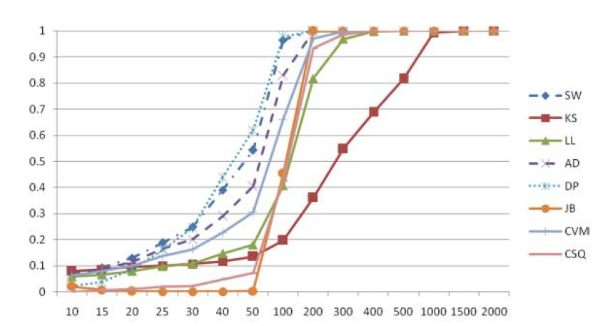

```{r, include=FALSE}
library(kableExtra)
library(knitr)
library(dplyr)
```

### Table 2

```{r}
titles <- c("n", "SW", "KS", "LL", "AD", "DP", "JB", "CVM", "CSQ")
x <- read.table("TablesFromPaper/2_1.csv")
colnames(x) <- titles
sizes <- x$n
y <- read.table("Table2/t2-uniform.csv")
colnames(y) <- titles
y <- y[y$n %in% sizes,]
```


```{r echo=FALSE}
x[5,3] <- cell_spec(x[5,3], format="html", color="red")
x %>%
  kable("html", align = 'c', caption = 'Uniform(0,1) from Paper', row.names=FALSE, escape=F) %>%
    kable_styling(full_width = F, position = "float_left", font_size=11) #%>% 
  #row_spec(5, bold=T, color="black", background="lightblue")

y[5,3] <- cell_spec(y[5,3], format="html", color = "red") 
y %>%
  kable("html", align = 'c', caption = 'Uniform(0,1) from Our Project', row.names=FALSE, escape=F) %>%
    kable_styling(full_width = F, position = "right", font_size=11) #%>% 
  #row_spec(5, bold = T, color = "black", background = "lightblue")
```

```{r}
x <- read.table("TablesFromPaper/2_2.csv")
colnames(x) <- titles
sizes <- x$n
y <- read.table("Table2/t2-genlam.csv")
colnames(y) <- titles
y <- y[y$n %in% sizes,]
```

```{r echo=FALSE}
x[4,4] <- cell_spec(x[4,4], format="html", color="red")
x %>%
  kable("html", align = 'c', caption = 'GLD(0, 1, 1.25, 1.25) from Paper', row.names=FALSE, escape=F) %>%
    kable_styling(full_width = F, position = "float_left", font_size=11) #%>% 
  #row_spec(5, bold=T, color="black", background="lightblue")

y[4,4] <- cell_spec(y[4,4], format="html", color = "red") 
y %>%
  kable("html", align = 'c', caption = 'GLD(0, 1, 1.25, 1.25) from Our Project', row.names=FALSE, escape=F) %>%
    kable_styling(full_width = F, position = "right", font_size=11) #%>% 
  #row_spec(5, bold = T, color = "black", background = "lightblue")
```

```{r}
x <- read.table("TablesFromPaper/2_3.csv")
colnames(x) <- titles
sizes <- x$n
y <- read.table("Table2/t2-truncnorm.csv")
colnames(y) <- titles
y <- y[y$n %in% sizes,]
```

```{r echo=FALSE}
x[6,6] <- cell_spec(x[6,6], format="html", color="red")
x %>%
  kable("html", align = 'c', caption = 'TRUNC(-2,2) from Paper', row.names=FALSE, escape=F) %>%
    kable_styling(full_width = F, position = "float_left", font_size=11) #%>% 
  #row_spec(5, bold=T, color="black", background="lightblue")

y[6,6] <- cell_spec(y[6,6], format="html", color = "red") 
y %>%
  kable("html", align = 'c', caption = 'TRUNC(-2,2) from Our Project', row.names=FALSE, escape=F) %>%
    kable_styling(full_width = F, position = "right", font_size=11) #%>% 
  #row_spec(5, bold = T, color = "black", background = "lightblue")
```

### Table 3

```{r}
x <- read.table("TablesFromPaper/3_1.csv")
colnames(x) <- titles
sizes <- x$n
y <- read.table("Table3/t3-t15.csv")
colnames(y) <- titles
y <- y[y$n %in% sizes,]
```

```{r echo=FALSE}
x[8,3] <- cell_spec(x[8,3], format="html", color="red")
x %>%
  kable("html", align = 'c', caption = 't(15) from Paper', row.names=FALSE, escape=F) %>%
    kable_styling(full_width = F, position = "float_left", font_size=11) #%>% 
  #row_spec(5, bold=T, color="black", background="lightblue")

y[8,3] <- cell_spec(y[8,3], format="html", color = "red") 
y %>%
  kable("html", align = 'c', caption = 't(15) from Our Project', row.names=FALSE, escape=F) %>%
    kable_styling(full_width = F, position = "right", font_size=11) #%>% 
  #row_spec(5, bold = T, color = "black", background = "lightblue")
```

```{r}
x <- read.table("TablesFromPaper/3_2.csv")
colnames(x) <- titles
sizes <- x$n
y <- read.table("Table3/t3-logistic.csv")
colnames(y) <- titles
y <- y[y$n %in% sizes,]
```

```{r echo=FALSE}
x[4,8] <- cell_spec(x[4,8], format="html", color="red")
x %>%
  kable("html", align = 'c', caption = 'Logistic from Paper', row.names=FALSE, escape=F) %>%
    kable_styling(full_width = F, position = "float_left", font_size=11) #%>% 
  #row_spec(5, bold=T, color="black", background="lightblue")

y[4,8] <- cell_spec(y[4,8], format="html", color = "red") 
y %>%
  kable("html", align = 'c', caption = 'Logistic from Our Project', row.names=FALSE, escape=F) %>%
    kable_styling(full_width = F, position = "right", font_size=11) #%>% 
  #row_spec(5, bold = T, color = "black", background = "lightblue")
```

```{r}
x <- read.table("TablesFromPaper/3_3.csv")
colnames(x) <- titles
sizes <- x$n
y <- read.table("Table3/t3-laplace.csv")
colnames(y) <- titles
y <- y[y$n %in% sizes,]
```

```{r echo=FALSE}
x[6,6] <- cell_spec(x[6,6], format="html", color="red")
x %>%
  kable("html", align = 'c', caption = 'Laplace from Paper', row.names=FALSE, escape=F) %>%
    kable_styling(full_width = F, position = "float_left", font_size=11) #%>% 
  #row_spec(5, bold=T, color="black", background="lightblue")

y[6,6] <- cell_spec(y[6,6], format="html", color = "red") 
y %>%
  kable("html", align = 'c', caption = 'Laplace from Our Project', row.names=FALSE, escape=F) %>%
    kable_styling(full_width = F, position = "right", font_size=11) #%>% 
  #row_spec(5, bold = T, color = "black", background = "lightblue")
```

### Table 4

```{r}
x <- read.table("TablesFromPaper/4_1.csv")
colnames(x) <- titles
sizes <- x$n
y <- read.table("Table4/weibull.csv")
colnames(y) <- titles
y <- y[y$n %in% sizes,]
```

```{r echo=FALSE}
x[1,3] <- cell_spec(x[1,3], format="html", color="red")
x %>%
  kable("html", align = 'c', caption = 'Weibull from Paper', row.names=FALSE, escape=F) %>%
    kable_styling(full_width = F, position = "float_left", font_size=11) #%>% 
  #row_spec(5, bold=T, color="black", background="lightblue")

y[1,3] <- cell_spec(y[1,3], format="html", color = "red") 
y %>%
  kable("html", align = 'c', caption = 'Weibull from Our Project', row.names=FALSE, escape=F) %>%
    kable_styling(full_width = F, position = "right", font_size=11) #%>% 
  #row_spec(5, bold = T, color = "black", background = "lightblue")
```

```{r}
x <- read.table("TablesFromPaper/4_2.csv")
colnames(x) <- titles
sizes <- x$n
y <- read.table("Table4/t4-lognormal.csv")
colnames(y) <- titles
y <- y[y$n %in% sizes,]
```

```{r echo=FALSE}
x[6,2] <- cell_spec(x[6,2], format="html", color="red")
x %>%
  kable("html", align = 'c', caption = 'Lognormal from Paper', row.names=FALSE, escape=F) %>%
    kable_styling(full_width = F, position = "float_left", font_size=11) #%>% 
  #row_spec(5, bold=T, color="black", background="lightblue")

y[6,2] <- cell_spec(y[6,2], format="html", color = "red") 
y %>%
  kable("html", align = 'c', caption = 'Lognormal from Our Project', row.names=FALSE, escape=F) %>%
    kable_styling(full_width = F, position = "right", font_size=11) #%>% 
  #row_spec(5, bold = T, color = "black", background = "lightblue")
```

```{r}
x <- read.table("TablesFromPaper/4_3.csv")
colnames(x) <- titles
sizes <- x$n
y <- read.table("Table4/loconnorm.csv")
colnames(y) <- titles
y <- y[y$n %in% sizes,]
```

```{r echo=FALSE}
x[3,4] <- cell_spec(x[3,4], format="html", color="red")
x %>%
  kable("html", align = 'c', caption = 'LoConN(0.2, 3) from Paper', row.names=FALSE, escape=F) %>%
    kable_styling(full_width = F, position = "float_left", font_size=11) #%>% 
  #row_spec(5, bold=T, color="black", background="lightblue")

y[3,4] <- cell_spec(y[3,4], format="html", color = "red") 
y %>%
  kable("html", align = 'c', caption = 'LoConN(0.2, 3) from Our Project', row.names=FALSE, escape=F) %>%
    kable_styling(full_width = F, position = "right", font_size=11) #%>% 
  #row_spec(5, bold = T, color = "black", background = "lightblue")
```

### Figure 1

```{r include=FALSE}
library(ggplot2)

# Kara's homebrew function to make a graph given the filename and distribution. Code primarily written by Kara
# with some help from Jeremiah. 

graph <- function(filename, distribution){
  table <- read.table(filename)
  data <- data.frame(table)
  ss <- data[,1]
  
  colors <- c("SW"="steelblue","KS"="red3","LL"="green3","AD"="blueviolet",
              "JB"="orange","CVM"="mediumpurple1", "DP"="cyan3", "CSQ"="rosybrown2")
  
  ggplot(data, aes(x=seq(1,15), y=seq(0,1,10))) + 
    geom_line(aes(y=powerSW, color="SW"), size=2) +
    geom_point(aes(y=powerSW, color="SW"), size=3.5) +
    geom_line(aes(y=powerKS, color="KS"),size=2) + 
    geom_point(aes(y=powerKS, color="KS"), size=3.5) +
    geom_line(aes(y=powerLL, color="LL"),size=2) +
    geom_point(aes(y=powerLL, color="LL"), size=3.5) +
    geom_line(aes(y=powerAD, color="AD"),size=2) +
    geom_point(aes(y=powerAD, color="AD"), size=3.5) +
    geom_line(aes(y=powerJB, color="JB"),size=2) +
    geom_point(aes(y=powerJB, color="JB"), size=3.5) +
    geom_line(aes(y=powerCVM, color="CVM"),size=2) +
    geom_point(aes(y=powerCVM, color="CVM"), size=3.5) +
    geom_line(aes(y=powerDP, color="DP"),size=2) +
    geom_point(aes(y=powerDP, color="DP"), size=3.5) +
    geom_line(aes(y=powerCSQ, color="CSQ"),size=2) +
    geom_point(aes(y=powerCSQ, color="CSQ"), size=3.5) +
    labs(x="sample size", y="power",title = distribution, color="Legend") +
    scale_x_continuous(breaks=seq(1,15),labels=c("10","15","20","25","30","40","50","100","200","300","400","500","1000","1500","2000")) +
    theme(plot.title = element_text(hjust = 0.5)) +
    scale_color_manual(values=colors)
}
```

{out.width=50%} {out.width=50%}

```{r echo=FALSE, out.size="50%", fig.show='hold'}

```

```{r echo=FALSE, out.size="50%"}
knitr::include_graphics("Figure1/fig1plotA.jpeg")
```


```{r echo=FALSE, out.width="50%"}
graph("Figure1/gld-a.csv", "GLD(0,1,0.75,0.75)")
```
